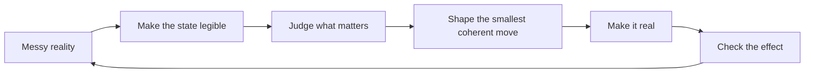

# Matt Lane — judgment, made visible.

  

  <strong>Product strategy · AI-native design · systems made workable</strong> 
  <a href="https://mattlane66.github.io"><strong>Open the site →</strong></a>

---

> **I make the hard parts visible.**
>
> The domains change. The move is surprisingly consistent: get close enough to feel the friction, step back far enough to see the system, decide what matters, make a coherent move, and find out whether reality agrees.

This repository is the source for my personal site, but the site is not really a catalog of projects. It is a record of **judgment becoming working form**.

Case studies show the judgment in context.  
Tools make parts of that judgment reusable.  
Side projects test ideas without waiting for permission.  
Writing catches thoughts before they harden into doctrine.  
Research is where some of those questions became formal enough to measure.

## The recurring loop

Different products put pressure on different parts of the loop. The common concern is not output for its own sake. It is preserving intent as an idea moves from **situation → decision → structure → interaction → effect**.

## One body of work, five forms

| | What is here | What it is really showing |
|---|---|---|
| **01 · Work in context** | [Splice](https://mattlane66.github.io/splice/), [NYSHEX](https://mattlane66.github.io/nyshex/), [CodeAI](https://mattlane66.github.io/codeai/) + PayPal, SimpleBet, and Bloomberg snapshots | How I frame ambiguous product problems, choose boundaries, make trade-offs, and turn strategy into a working system |
| **02 · Things I wanted to exist** | Spatial audio, Writing Assistant, WatchNotes, *That's You Too*, Rawls Dashboard, Crushed | What happens when curiosity gets a build button |
| **03 · Thinking in tools** | [Fit Check](https://mattlane66.github.io/fit-check/), [Planning Tools](https://mattlane66.github.io/planning-tools/), Dumplink, Team Shaping Playing Field, Scaled Interview Data Assistant | Methods made executable instead of left as advice |
| **04 · Publications** | Machine learning, Kickstarter outcomes, delivery rates | Questions pushed far enough to become formal research |
| **05 · Unfinished thinking** | [316 notes](https://mattlane66.github.io/notes/) and counting | Ideas while they are still moving |

## Three cases, three versions of the same problem

### 🎵 Splice — constrain the product until the value becomes clear
**Create / Stacks** started from a deliberately narrow song starter. The interesting part was not adding more generative capability. It was choosing how much of the creative process Splice should own, then using that boundary to move the product from **finding sounds** toward **reaching a promising musical idea**.

→ [Open the interactive case](https://mattlane66.github.io/splice/)

### 🚢 NYSHEX — make the state trustworthy before asking for a decision
Freight teams had data. The harder problem was that they still had to reconcile it before acting. The product move was to make the state of a shipment **legible enough that someone could decide what to do next**.

The sequence became:

**interpret less → see the decision → act**

→ [Open the case](https://mattlane66.github.io/nyshex/)

### 🧠 CodeAI — an answer can be correct and still be bad tutoring
A generic assistant can optimize for completing the request. A learning product has another job: help the student move **without removing the thinking they are supposed to learn**.

That meant turning curriculum, task state, the student's artifact, and instructional boundaries into context an LLM could actually act on.

→ [Open the case](https://mattlane66.github.io/codeai/)

## Methods should do work

I am interested in methods only when they change what someone can see or do.

**Fit Check** asks two different questions that product work often collapses into one:

- **Conformance** — did we represent and build the thing correctly?
- **Effect** — did that thing actually produce the change we wanted?

A design can pass every local check and still fail in the world. So the working rule is:

> **Build forward. Verify locally. Diagnose backward. Correct against reality.**

[Use Fit Check →](https://mattlane66.github.io/fit-check/)

**Planning Tools** follows the same bias from another direction: take messy product material and preserve intent as it becomes a buildable slice rather than laundering uncertainty into a neat-looking plan.

[Open Planning Tools →](https://mattlane66.github.io/planning-tools/)

The other tools on the site explore the same territory: shaping work, preserving boundaries, tracing evidence, making dependencies visible, and keeping the whole coherent while the parts change.

## A few notes from the margins

> **The new contemporary always arrives late.**

> **Don't dumb it down, smarten it up to simple.**

> **It's easier to agree on what exists than what is good.**

> **I can get non-determinism from humans. Thank you.**

Those are not a manifesto. They are evidence of an ongoing argument with the world.

→ [Browse the notes](https://mattlane66.github.io/notes/)

## Formal research

- **Bridging the Gap: A Guide to Machine Learning for Non-Machine Learning Engineers**  
  Loyola University Chicago · 2024  
  [Read the publication →](https://www.luc.edu/quinlan/whyquinlan/centersandlabs/labforappliedartificialintelligence/publishedresearch/2024/1stquarter2024/bridgingthegapaguidetomachinelearningfornon-machinelearningengineers/)

- **Containing Multitudes: The Many Impacts of Kickstarter Funding**  
  University of Pennsylvania · Wharton School · 2016  
  [Read the paper →](https://papers.ssrn.com/sol3/papers.cfm?abstract_id=2808000)

- **Delivery Rates on Kickstarter**  
  University of Pennsylvania · Wharton School · 2015  
  [Read the paper →](https://papers.ssrn.com/sol3/papers.cfm?abstract_id=2699251)

## If you only have five minutes

**Want to know how I think about product strategy?**  
Read [Splice](https://mattlane66.github.io/splice/) and [NYSHEX](https://mattlane66.github.io/nyshex/).

**Want to know how I think about AI products?**  
Read [CodeAI](https://mattlane66.github.io/codeai/) and use [Fit Check](https://mattlane66.github.io/fit-check/).

**Want the current experiments and obsessions?**  
Start at [the homepage](https://mattlane66.github.io/#projects), then fall into the side-project links.

**Want the least filtered version?**  
Read the [notes](https://mattlane66.github.io/notes/).

## Under the hood

The site is deliberately plain HTML, CSS, and JavaScript served directly by GitHub Pages. No build system is required.

That constraint is useful: the repository stays inspectable, the case studies can be self-contained, and an idea can move from sketch to public artifact without much ceremony.

<strong>Site map for people who came here to inspect the repo</strong>

- `/` — portfolio, projects, tools, publications, writing
- `/about/` — about
- `/splice/` — Splice Create / Stacks case
- `/nyshex/` — NYSHEX case
- `/codeai/` — CodeAI / AI Tutor case
- `/fit-check/` — interactive Fit Check method
- `/planning-tools/` — interactive planning lab
- `/notes/` — notes archive
- `/assets/` — site imagery and visual artifacts

---

  <strong>Get close. See the system. Decide what matters. Make it real.</strong>  
  <a href="https://mattlane66.github.io">mattlane66.github.io →</a>

