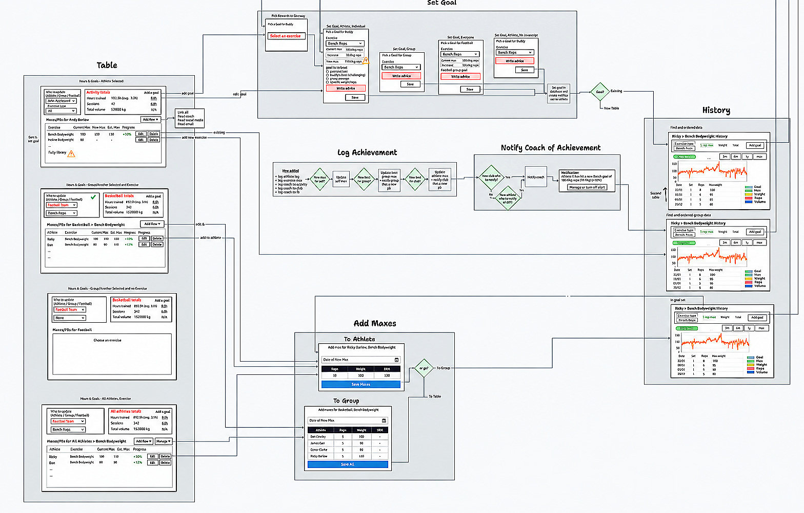

# Matt Lane

A place for things I make, things I think about, and things I couldn't stop myself from building.

  

  <a href="https://mattlane66.github.io">Visit the site →</a>

---

I'm a product strategist, builder, and occasional over-thinker.

I've spent my career turning fuzzy ideas into real things — from startups and AI products to tools, experiments, and the occasional weird side project.

This repo powers my personal site. The site tells the stories. This is just the workshop for it.

## What's inside

🧩 **Case studies**  
Real product work: Splice, NYSHEX, CodeAI, and more.

🛠️ **Tools & experiments**  
Things I built because I wanted them to exist.

✍️ **Writing**  
Half-formed ideas, finished arguments, and everything in between.

📚 **Research**  
A few things that escaped into academia.

## A few things I like

- Making complicated things easier to see
- Building before everything is perfectly clear
- Finding the useful idea hiding inside the messy one
- Good coffee ☕
- Bad interfaces getting fixed
- Strange little prototypes

## Built with

Plain HTML, CSS, and JavaScript.

No framework. No magic. Just files you can open and understand.

## Explore

→ [Portfolio](https://mattlane66.github.io)  
→ [Projects](https://mattlane66.github.io/#projects)  
→ [Notes](https://mattlane66.github.io/notes/)

---

Made by Matt Lane
